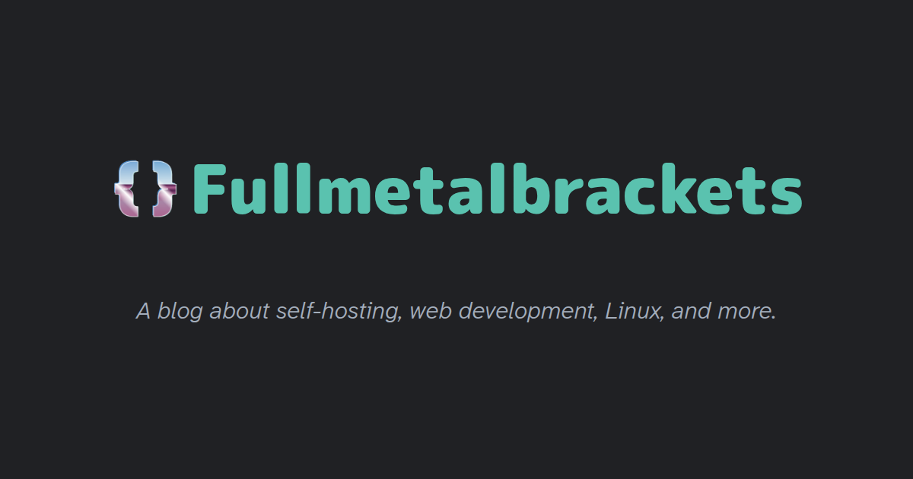

# html-to-og

Generate 1200x630 Open Graph images from an HTML template using Puppeteer.

## Installation

```bash
git clone https://github.com/fullmetalbrackets/html-to-og.git
cd html-to-og
npm i
```

## Usage

Edit the template HTML file at `template/og.html`. (Or drop in your own, as long as you name it `og.html` so the script can pick it up.)

Any other necessary files like stylesheets, fonts and images go in the `template/` directory as well.

When ready to generate an image, run:

```bash
npm start
```

Generated images are saved to `output/` as `og-card1.png`, `og-card2.png`, etc. Each run creates a new numbered file without overwriting previous versions.

To clear out the `output/` directory of all PNGs, run:

```bash
npm run clean
```

## Example

This is the OG image generated for [my own site](https://fullmetalbrackets.com) based on `template/og.html`:


## How It Works

The script uses Puppeteer to:

1. Load your HTML template in a headless browser
2. Set viewport to 1200x630 (Open Graph standard size)
3. Capture a screenshot of the `.og-card` element
4. Save the PNG to the output directory

## Requirements

- Node.js >= 18.0.0

## Structure

```
.
├── template/            # place any images, fonts or css files here
│   └── og.html          # Edit or replace this template
├── output/              # Generated images appear here
└── html-to-og.mjs       # Script to generate images from og.html file
```
